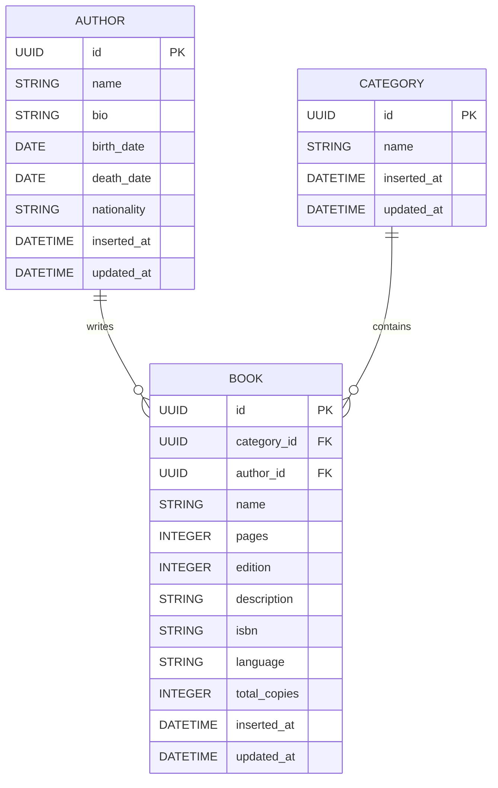

# 🔐 AlASHandria - System architecture

This file contains implementation details about the system, with tables layout and some implementation decisions.

## Stack

### Backend

- **Language**: Elixir
- **Framework Web**: Ash Framework with Absinthe
- **Database**: Mnesia (in memory database)

## Data Architecture

### ER Diagram

